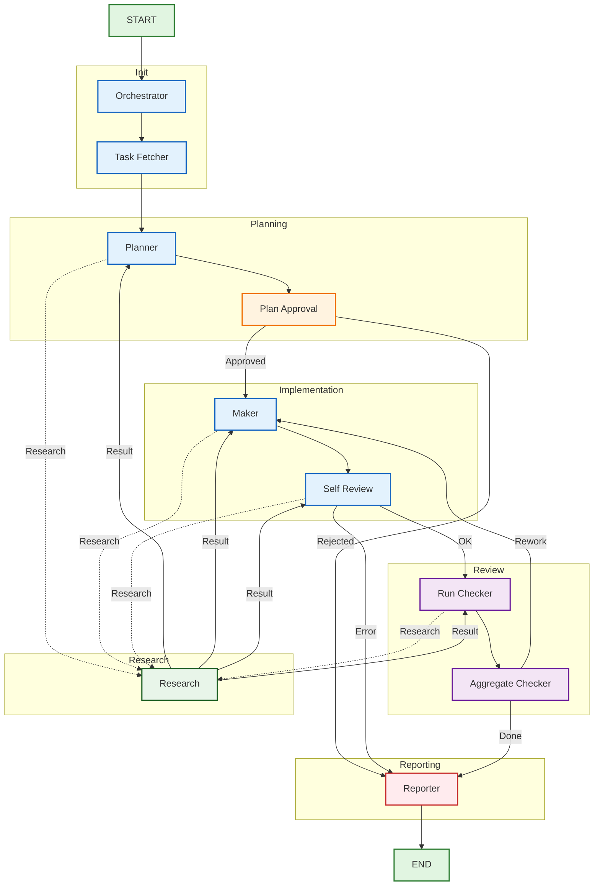

# Architecture

## Graph overview



## Nodes

| Node | Responsibility |
|------|----------------|
| `orchestrator` | Initializes state, resets reducers, logs the task. |
| `task_fetcher` | Loads a task from the configured `TaskSource` by ID or fetches the first open task. |
| `planner` | Generates an implementation `Plan` with steps, files to touch, and tests. Can request on-demand research via `Command(goto="research")`. |
| `plan_approval` | Human-in-the-loop gate. Auto-approves when `human_in_the_loop=false` or `auto_approve=true`. |
| `maker` | Checks out a fresh git worktree, applies file operations, runs tests, and commits. Can request on-demand research before applying changes. |
| `self_review` | Reviews the diff against the plan and reports issues. Can request on-demand research. |
| `run_checker` | Runs a single checker subagent. Dispatched in parallel for `checker_a`, `checker_b`, `checker_c`. |
| `aggregate_checker` | Aggregates checker reports into `final_verdict` and increments `rework_count`. |
| `research` | Runs an on-demand research query against configured sources (MCP, git, filesystem, web) and returns the result to the caller node. |
| `reporter` | Produces PR description, corporate report, and updates the external task tracker. |

## On-demand research

Any agent node can return `Command(goto="research", update={"research_request": ...})` to gather additional context. The `research` node:

1. Reads `research_request` from state.
2. Optionally interrupts for human clarification when `request_human_clarification=true`.
3. Runs enabled sources from `config/research_sources.yaml`.
4. Aggregates findings into a `ResearchResult` stored in `last_research_result`.
5. Routes back to the caller node identified by `research_request.caller`.

The caller node sees the result on its next execution and can request further research up to `max_research_calls_per_node`.

## Research sources

Sources are configured in `config/research_sources.yaml`:

```yaml
request_human_clarification: false
max_research_calls_per_node: 3
sources:
  - name: graphify_mcp
    driver: graphify_mcp
    enabled: false
    config:
      server_url: ${GRAPHIFY_MCP_URL:-http://localhost:8000}
  - name: git_tools
    driver: git_tools
    enabled: true
    config:
      repo_path: .
```

Built-in drivers:

| Driver | Description |
|--------|-------------|
| `graphify_mcp` | Symbol/file search through a Graphify MCP server. |
| `mcp_generic` | Calls a configurable tool on any MCP server. |
| `git_tools` | `git grep` and `git log --grep` over the repository. |
| `file_system` | File name and content search under a root directory. |
| `web_search` | Web search via `duckduckgo-search` (optional dependency). |

New drivers can be added under `src/devflow/research/sources/` and registered in `SourceFactory.default()` without changing the `research` node itself.

## Human-in-the-loop

Plan approval and research both use LangGraph's `interrupt()`. When the graph hits the `plan_approval` or `research` node it pauses and stores the interrupt payload. Resume by calling `graph.invoke(..., config)` with a `Command(resume=...)` value.

Example resume for plan approval:

```python
{
    "approved": True,
    "reason": "Plan looks good",
    "requested_changes": [],
}
```

Example resume for research clarification:

```python
"Refined research query"
```

## Persistence

`build_graph()` uses `langgraph.checkpoint.memory.InMemorySaver` by default.
Pass a custom `checkpointer` (for example, a SQLite or Postgres saver) to
enable resumption across process restarts.
