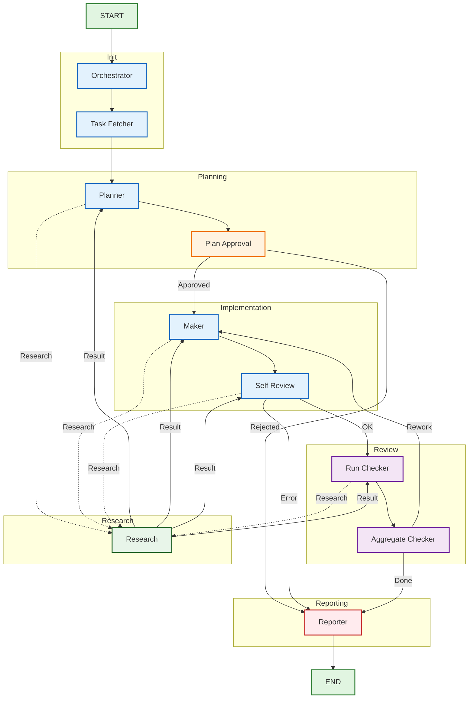

# Architecture

## Graph overview



## Nodes

| Node | Responsibility |
|------|----------------|
| `orchestrator` | Reads `TODO.md`, selects the topmost actionable task by `#r0`–`#r5` priority, marks it `[~]` (in progress), hydrates tracker links via `get_task_details`, and puts the task into state. Generates `TODO.md` from the task source if the file is missing. Defers to `task_fetcher` when an explicit `--task-id` is passed. |
| `task_fetcher` | Loads a task from the configured `TaskSource` by ID, or passes through when the orchestrator already placed a task in state. |
| `planner` | Generates an implementation `Plan` with steps, files to touch, and tests. Can request on-demand research via `Command(goto="research")`. |
| `plan_approval` | Human-in-the-loop gate. Auto-approves when `human_in_the_loop=false` or `auto_approve=true`. |
| `maker` | Checks out a fresh git worktree, applies file operations, runs tests, and commits. Can request on-demand research before applying changes. |
| `self_review` | Reviews the diff against the plan and reports issues. Can request on-demand research. |
| `run_checker` | Runs a single checker subagent. Dispatched in parallel for `checker_a`, `checker_b`, `checker_c`. |
| `aggregate_checker` | Aggregates checker reports into `final_verdict` and increments `rework_count`. |
| `research` | Runs an on-demand research query against configured sources (MCP, git, filesystem, web) and returns the result to the caller node. |
| `reporter` | Produces PR description and corporate report, publishes to notification channels, updates the external task tracker status, and writes a short inline result (`[x] — ✅ done: …` / `⚠️ problem: …`) back into the originating `TODO.md` line. |

## TODO.md task queue

`TODO.md` (path configurable via `workflow.todo_path`, `--todo-path`, or
`DEVFLOW_TODO_PATH`) is the orchestrator's entry queue. Each actionable line is
a markdown checkbox carrying a priority tag:

```
- [ ] #r0 [#251977](https://tracker/issues/251977) — Immediate fix
- [ ] #r2 [#MOCK-1] — Refactor the loader
- [ ] #r3 — A free-form human task
```

The lifecycle of a line:

1. **`[ ]` open** — selectable. The orchestrator picks the entry with the
   smallest `#r` (highest priority); ties go to the topmost line. Lines
   without a `#rX` tag are preserved on disk but never selected.
2. **`[~]` in progress** — the orchestrator flips the checkbox when it takes
   the task, so a crashed run is not silently restarted on the next launch
   (flip it back to `[ ]` manually to retry).
3. **`[x]` done** — the reporter appends an inline result suffix
   (` — ✅ done: …` on approve, ` — ⚠️ problem: …` otherwise) and caps it to
   ~200 characters.

Tracker links (`[#id](url)`) are hydrated with full details from the task
source; bracket refs without a URL (`[#MOCK-1]`) still resolve by id. Entries
without any reference become local tasks whose id is derived from their line
number.

If `TODO.md` does not exist when the workflow starts, the orchestrator
generates it from the source's open tasks (sorted by priority). The same
generation logic is exposed as `devflow-super list-tasks --todo`.

## On-demand research

Any agent node can return `Command(goto="research", update={"research_request": ...})` to gather additional context. The `research` node:

1. Reads `research_request` from state.
2. Optionally interrupts for human clarification when `request_human_clarification=true`.
3. Runs enabled sources from `config/research_sources.yaml`.
4. Aggregates findings into a `ResearchResult` stored in `last_research_result`.
5. Routes back to the caller node identified by `research_request.caller`.

The caller node sees the result on its next execution and can request further research up to `max_research_calls_per_node`.

## Research sources

Sources are configured in `config/research_sources.yaml`:

```yaml
request_human_clarification: false
max_research_calls_per_node: 3
sources:
  - name: graphify_mcp
    driver: graphify_mcp
    enabled: false
    config:
      server_url: ${GRAPHIFY_MCP_URL:-http://localhost:8000}
  - name: git_tools
    driver: git_tools
    enabled: true
    config:
      repo_path: .
```

Built-in drivers:

| Driver | Description |
|--------|-------------|
| `graphify_mcp` | Symbol/file search through a Graphify MCP server. |
| `mcp_generic` | Calls a configurable tool on any MCP server. |
| `git_tools` | `git grep` and `git log --grep` over the repository. |
| `file_system` | File name and content search under a root directory. |
| `web_search` | Web search via `duckduckgo-search` (optional dependency). |

New drivers can be added under `src/devflow/research/sources/` and registered in `SourceFactory.default()` without changing the `research` node itself.

## Human-in-the-loop

Plan approval and research both use LangGraph's `interrupt()`. When the graph hits the `plan_approval` or `research` node it pauses and stores the interrupt payload. Resume by calling `graph.invoke(..., config)` with a `Command(resume=...)` value.

The interactive runner `run_workflow_interactive()` (in `src/devflow/graph.py`) is the resume consumer: it detects the pending interrupt, invokes an `approval_callback` to obtain a resume value, and continues the graph. The CLI `run`/`run-all` commands wire this callback to the Telegram bridge (see [Notifications](#notifications)) when `TELEGRAM_BOT_TOKEN`/`TELEGRAM_CHAT_ID` are set and `human_in_the_loop` is enabled.

Example resume for plan approval:

```python
{
    "approved": True,
    "reason": "Plan looks good",
    "requested_changes": [],
}
```

Example resume for research clarification:

```python
"Refined research query"
```

## Notifications

Final reports and errors are published to pluggable notification channels via
the `NotificationChannel` ABC + factory (mirroring the `TaskSource` plug-in
pattern). Built-in channels live under `src/devflow/notifications/`:

| Channel | Description |
|---------|-------------|
| `console` | Logs the Markdown report via the standard logger. |
| `telegram` | Sends the report (and interactive approvals) via the Telegram Bot API. |
| `github` / `gitlab` / `slack` / `teams` | Recognised stubs — skipped with a warning until implemented. |

The reporter node builds a Markdown summary and publishes it to every channel
listed in `corporate_report_channels` (`config/workflow.yaml`). If the workflow
reached the reporter due to an error, an error notification is published first.

The Telegram channel (`src/devflow/notifications/telegram.py`) also exposes
interactive helpers (inline keyboards, callback-query and text-reply long
polling) used by `src/devflow/telegram_bridge.py` to drive plan approval
through a chat: the bot sends the plan with ✅/❌/✏️ buttons and collects the
human decision.

## Persistence

`build_graph()` uses `langgraph.checkpoint.memory.InMemorySaver` by default.
Pass a custom checkpointer (for example, a SQLite or Postgres saver) to
enable resumption across process restarts.
